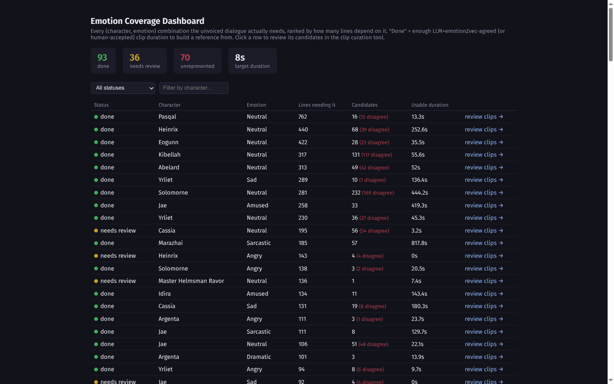
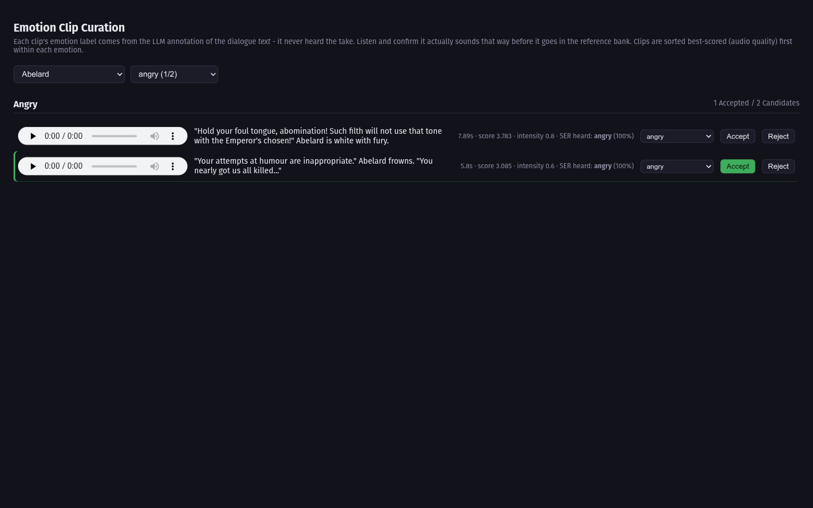
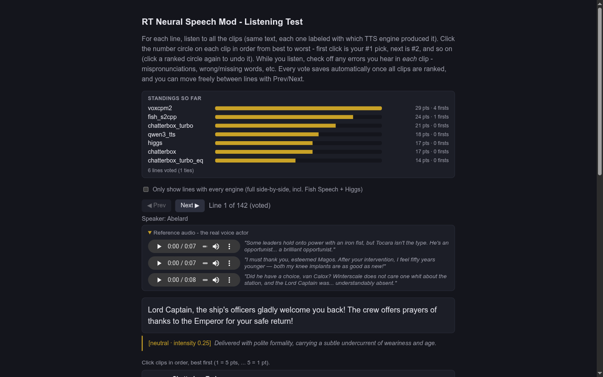
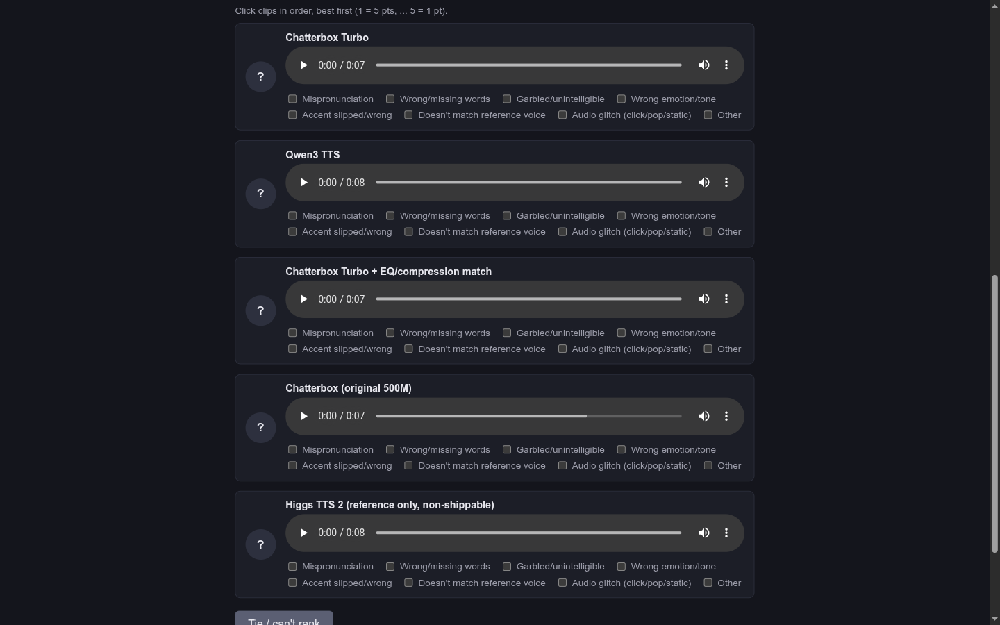

# W40K Rogue Trader - Neural Speech Mod

Live, local, neural text-to-speech for the ~90% of Warhammer 40,000: Rogue Trader that ships
unvoiced. Per-character voices, emotion-annotated delivery, and Linux/Proton is priority #1
here, not a Windows port bolted on afterward (thats part of why this is taking a while).

Nothing here calls out to a cloud API, and nothing ships as pre-rendered audio. The game and the
voice server that actually runs the TTS model are separate processes talking plain HTTP, on
purpose - same PC or a different machine on your LAN, your call, and either OS can be either
role. Details: [Where the TTS engine runs](#where-the-tts-engine-runs).

Status: full corpus is annotated now (45,114 previously-silent lines, emotion/pace/delivery
tagged per line) and audio generates end to end. Right now I'm running listening tests to lock
in the default TTS engine before cutting a first release - see `PROJECT_PLAN.md` if you want
the full (very long) progress log.

## How this differs from other Rogue Trader voice mods

| | This mod | [SpeechMod](https://github.com/Osmodium/W40KRogueTraderSpeechMod) (Osmodium) | [AI Voiceover Mod](https://github.com/pas2k/W40KRT_AIVOMod) (pas2k) |
|---|---|---|---|
| Speech source | Live neural TTS, synthesized on your machine as lines come up | Windows SAPI / macOS `say` | Chatterbox TTS, pre-rendered once by the author and shipped as `.bnk` soundbanks |
| Delivery | Directed per line: 45,114 unvoiced lines are tagged with emotion, pace, and delivery instructions before synthesis (see below) | Flat - adjustable rate/pitch/volume, but no per-line emotional direction | Fixed at render time - the mod's own docs describe "a limited roster of emotions/archetypes" |
| Voice variety | One voice per major companion, with emotion-matched reference clips in progress (see below) | Protagonist / male / female / narrator voices | One voice pack, built for a male player character only |
| Player character's voice | Planned: your own dialogue rendered in whatever voice you picked at character creation, toggleable and re-pickable from the mod menu | One fixed "protagonist" voice, not tied to what you actually picked at creation | Fixed male-Rogue-Trader voice pack only - no player choice, no female protagonist support |
| Platform | Linux/Proton first, Windows to follow | Windows and macOS only - no Linux/Proton support | Works wherever the game's Wwise banks load (platform-agnostic, since it's pre-baked audio) |
| Cost / licensing | Free, MIT | Free, MIT | Free, MIT |

Worth a mention even though it's for a different game:
[Ripcy's RSpeechMod](https://www.nexusmods.com/pillarsofeternity/mods/430) for *Pillars of
Eternity* proves live, in-process neural TTS inside a UMM-modded Unity game works at all
(sherpa-onnx running Piper/Kokoro). Its source has no license attached though, so it's reference
material, not something this mod builds on.

## Layout

| Path | What |
|---|---|
| `src/DialogueExporter/` | UMM mod: dumps the game's dialogue blueprint graph to `script.json` (run once at the main menu) |
| `src/RogueTraderNeuralSpeechMod/` | The runtime mod (UMM): hooks dialogue, resolves annotations, calls the voice server, plays back audio |
| `src/TtsSidecar/` | The voice server (Linux/Python/GPU today): text + speaker + annotation → synthesized PCM, per-engine directive translation |
| `tools/extract_localization.py` | Localization strings + voiced map + 40K vocabulary worklist |
| `tools/build_conversations.py` | Walks the cue graph into ordered, speaker-attributed conversation scripts |
| `tools/unpack_pck.py`, `tools/extract_voice_lines.py` | Wwise `.pck` → speaker-attributed WAV clips of the official VO (stays on your machine) |
| `tools/build_prompt_banks.py` | Picks clean reference clips per speaker for zero-shot voice cloning |
| `tools/build_test_set.py` | Fixed 142-line bake-off set (unvoiced lines per companion + narration) |
| `tools/tts_bakeoff/` | Runs candidate TTS engines over the test set; scores speaker-similarity + WER |
| `tools/annotate/` | LLM annotation harness: emotion/pace/non-verbal/instruct labels per line, engine-neutral schema |
| `tools/score_catalog_emotions.py` | Audio-based emotion scoring (emotion2vec+) of the official VO clips, checked independently against the LLM's text-based read |
| `tools/emotion_review/` | Local dashboard + listen-and-decide tool for curating per-character, per-emotion reference-clip banks |
| `tools/audio_match/` | Fits an EQ/compression profile from real VO vs. generated clips to closer-match a TTS engine's output |
| `tools/listening_test/` | Local labeled listening-test server: ranks engines head-to-head per line, tallies a Borda count |
| `docs/research/` | Ecosystem research reports |
| `reference/` (gitignored) | Clones of prior art: Osmodium SpeechMod (MIT), pas2k AIVO (MIT), Ripcy RSpeech (no license - study only) |

## Directed delivery, not just words

TTS models default to a flat read - technically correct, dramatically dead. Two separate
annotation passes exist to fight that, aimed at the two different places delivery comes from:

**1. What to say it like.** Every one of the 45,114 previously-unvoiced lines has been run
through an LLM annotation pass (14B model, with a per-companion character bio for context) that
tags emotion, pace, and a short delivery instruction alongside the text itself. The runtime mod
resolves this per line and passes it to the voice server, which translates the neutral tags into
whatever directive format the active engine actually responds to.

**2. What to clone from.** Zero-shot voice cloning inherits the prosody of whatever reference
clip it's given - clone a companion's voice from one calm, neutral line and every emotion comes
out sounding calm and neutral, tags or no tags. So instead of one reference clip per character,
the goal is a small bank of reference clips per character *per emotion*, pulled from that
character's own official voiced lines. Coverage is tracked on a local dashboard (every
character/emotion combination the corpus actually needs, ranked by how many lines depend on it),
and each candidate clip gets a human listen-and-decide pass before it's accepted into the bank:





Snapshot at the time of writing, not a finished count - the corpus keeps growing. Like
everything else here, this only touches your own locally-extracted game audio, never anything
redistributed.

## Choosing the TTS engine

Published benchmarks don't tell you which engine actually sounds best on real annotated Rogue
Trader lines, so there's a local tool for comparing them head-to-head instead of guessing: the
same line, all engines side by side and labeled (not blind), ranked best-to-worst with a Borda
count, plus per-clip error tagging (mispronunciation, wrong emotion, doesn't match the reference
voice, and so on).





Seven engines and variants have gone through this so far, including one - Higgs TTS 2 - kept in
purely as a quality reference even though its license rules it out as a shippable default. This
is what decides the default engine before the first release, not a spec sheet.

## Where the TTS engine runs

The runtime mod never synthesizes audio itself - it sends `{text, speaker, annotation}` to a
voice server over HTTP and gets back a WAV. That's the whole design point: the game and the
voice server are always separate processes speaking the same protocol, so where each one runs
is a deployment choice, not an architecture choice. Same machine is the simplest setup and the
only one that works today (see below); a second machine on your LAN, or even a different OS on
each side, is meant to work exactly the same way once that's built.

The voice server's engine backend does vary by platform - Python/PyTorch/GPU on Linux (working
today), ONNX Runtime on Windows (planned, avoids needing Python/CUDA installed at all - see
`PROJECT_PLAN.md`) - but both talk the same `/synth` protocol, so a Windows game client can point
at a Linux voice server, a Linux client can point at a Windows one, and so on. macOS support for
*running* the voice server itself is unresearched (Apple's Core ML/MLX stack, unproven for any
of the bake-off's candidate engines); a macOS game client pointing at a Linux or Windows voice
server on the LAN needs nothing new once that mode ships.

Today, none of that is built yet: the voice server's bind address and the mod's server URL are
both hardcoded to `127.0.0.1`, so it has to be the same PC as the game. Handing synthesis off to
a second machine - a spare-GPU box while the game runs on something lighter, in either direction
- is planned but not started. When it lands: a mod-menu field for the server's address, no
built-in authentication (this is for your own trusted home network - don't port-forward it to
the internet), and a line that fails to get audio back in time gets skipped rather than stalling
dialogue, with a brief in-game notice instead of a silent gap.

## Design (agreed on so far)

- Fork of Osmodium's SpeechMod hook layer (MIT), new `ITtsBackend`/`IAudioOutput` seam.
* Game and voice server are always separate processes over HTTP (GUID-keyed disk cache,
  graph-lookahead prefetch to hide latency) - same machine today, LAN-splittable once that
  ships. See [Where the TTS engine runs](#where-the-tts-engine-runs).
- Offline pipelines: dialogue export → LLM emotion annotation (`annotations.<locale>.json`) →
  runtime dictionary lookup. 40K phonetic lexicon applied per engine (IPA where supported,
  respelling otherwise).
- Voiced lines (`Sound.json`) never get re-synthesized, official VO always wins over anything
  generated.
- Voice cloning from the player's own game files happens locally and is opt-in - no cloned
  voice data is ever distributed. Shipped default voices are synthesized from scratch.
- Planned: synthesize the player character's own dialogue in whatever voice they picked at
  character creation - not a generic "protagonist" preset, the specific voice for the specific
  character you made. Mod menu will let you turn it off, or re-pick the voice later, if you'd
  rather not hear your own lines read back.

## Building the exporter (Linux)

```
export DOTNET_ROOT=$HOME/.dotnet PATH=$HOME/.dotnet:$PATH
dotnet build src/DialogueExporter -c Release -t:Deploy   # paths in Directory.Build.props
```

## Credits

Wouldn't exist without this prior art:

- [SpeechMod](https://github.com/Osmodium/W40KRogueTraderSpeechMod) by Osmodium (MIT) - hook architecture
- [W40KRT_AIVOMod](https://github.com/pas2k/W40KRT_AIVOMod) by pas2k (MIT) - Wwise VO-shim approach, wwnames trick
- [wwiser](https://github.com/bnnm/wwiser) by bnnm - dev-only tool for local Wwise bank extraction,
  **not bundled**: the repo has no LICENSE file granting redistribution rights, so contributors
  must download it themselves (link above) rather than vendor the binary in a release zip
- [vgmstream](https://vgmstream.org) - ISC license (permissive, bundling-safe). Copyright (c)
  Adam Gashlin, Fastelbja, Ronny Elfert, bnnm, Christopher Snowhill, NicknineTheEagle, bxaimc,
  Thealexbarney, CyberBotX, EdnessP, and contributors, with portions by Marko Kreen, jagarl,
  Nullsoft, Paul Hsieh, Lesahde Entis, and Sun Microsystems (see vgmstream's `COPYING`). Official
  prebuilt CLI binaries exist for Windows/macOS/Linux, so per-OS bundling is viable once a
  release needs it - check whether the vendored build links LGPL components (mpg123, FFmpeg)
  dynamically or statically before shipping, per vgmstream's own `doc/BUILD.md`.
